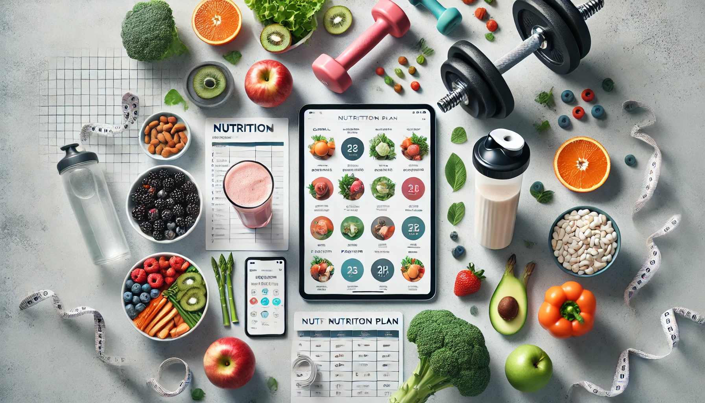

# 🏋️‍♂️ Fitness & Nutrition Tracker App

A **Streamlit-based fitness, workout progress and calorie recommendation system** that combines:
- Personalized calorie calculation
- Indian food diet planning
- Weekly workout schedule automation
- MongoDB-based progress logging
- AI-assisted progressive overload planning
- Background gym visuals and UI enhancement

This project uses **machine learning clustering (KMeans)** to auto-generate future workout load increases based on logged training data.

---

## 📸 App Visual Theme

The UI uses high-contrast gym visuals and nutrition elements as background styling.
Example visuals used:

| Workout Visual | Nutrition Visual |
|---------------|------------------|
| (Gym silhouettes, strength, cardio)  | (Fruits, protein bowls, dumbbells, macros)  |

> Images are encoded as Base64 and set as full-screen Streamlit backgrounds.

---

## 🚀 Features

| Module | Description |
|--------|-------------|
| **Calorie Calculator** | Uses Mifflin-St Jeor formula to estimate calories |
| **Diet Recommendations** | Suggests Indian foods per meal category |
| **Weekly Workout Plan** | Auto-randomized 7-day structured training |
| **Progress Logging** | Stores sets, reps, weight to MongoDB |
| **Progress Insights** | Table & weekly review |
| **Progressive Overload ML** | Uses KMeans clustering to scale training 4-week load |
| **UI Enhancements** | Full HD overlay backgrounds, white text UI |

---

## 🧠 Code Basis

### 🎯 Main Application Logic (Homepage & Tabs)
- Calories, workout, recommendations, logging, ML overload:
  - Implemented in **main.py**  
    :contentReference[oaicite:0]{index=0}

### 🎯 UI with Background Image Encoding
- Base64 conversion for background visual:
  - Streamlit CSS injection & encoded JPEG
  - Referenced also in secondary script variant  
    :contentReference[oaicite:1]{index=1}

---

## 📁 Project Structure

```bash
fitness-tracker-app/
├── main.py
├── workout_data.csv
├── indian_foods.csv
├── progress.csv (optional export)
├── bg1.jpg (workout background)
├── bg2.jpg (nutrition background)
├── requirements.txt
├── README.md
